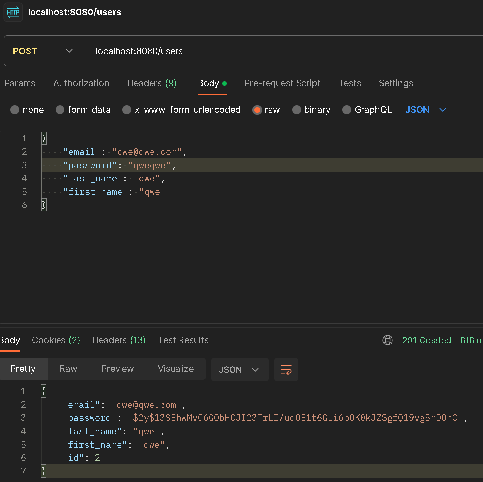
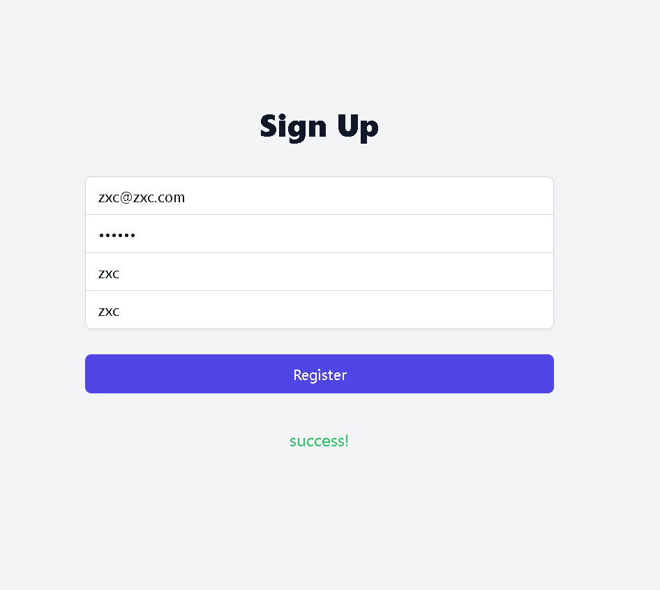

# Test task yii2 vue.js

### Задание:[Тестовое задание на позицию PHP разработчика.pdf](%D2%E5%F1%F2%EE%E2%EE%E5%20%E7%E0%E4%E0%ED%E8%E5%20%ED%E0%20%EF%EE%E7%E8%F6%E8%FE%20PHP%20%F0%E0%E7%F0%E0%E1%EE%F2%F7%E8%EA%E0.pdf)

## Preview
### Backend

### Frontend

``
Stack: Yii2, Vue.js, Tailwind - RESTfull API
``

## Инструкция По Запуску:


+ ``` Clone the repo```


+ ``` cd yii2-vue-signup-test-task```


+ ```docker-compose up --build -d```


+ ```docker-compose run -it server composer install```


+ ```docker-compose run -it server php yii migrate```

#### Сервер backend доступен на 8080 порту (localhost)

#### Сервер frontend доступен на 5000 порту (localhost)

### Проверить корректность веб-сервиса можно по эндпоинтам:
http://localhost:8080/users (GET - All Users)
http://localhost:8080/users/{id} (GET - User By Id)
